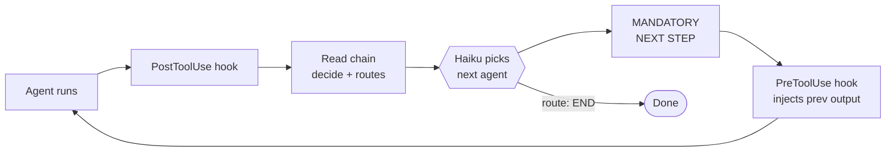

# brainbrew-devkit

**Self-correcting agent chains for Claude Code, opencode, and Codex.**

A chain of agents takes turns. One plans, one codes, one reviews, one tests, one commits. If an agent fails, another agent fixes it and the chain retries — automatically.

You watch. Approve the PR. Done.

## How it works



That's the whole engine. Each lap of the loop = one agent step.

- **You** define the chain (`flow:` in YAML — agents and their routes).
- **Hooks** fire automatically — no glue code.
- **Haiku** reads the agent's output against the `decide:` prompt and picks the next route.
- **Context** carries forward — previous agent's full output is injected into the next agent's prompt.
- **Failure** is just another route — point it at a `debugger` agent and the chain self-corrects.

## Quick start

**Requires** [Claude Code](https://docs.claude.com/en/docs/claude-code), [opencode](https://opencode.ai), or Codex + Node.js 18+.

**Install** (then restart Claude Code):

```
/plugin marketplace add brainbrewlabs/brainbrew-devkit
/plugin install brainbrew-devkit
```

**Run:**

```
/code add a login button
```

The chain handles routing, retries, and coordination.

### opencode users

brainbrew-devkit also runs under [opencode](https://opencode.ai) via the [oh-my-opencode (OHO)](https://github.com/code-yeongyu/oh-my-opencode) plugin.

> **Prerequisite:** you must install the plugin in **Claude Code** first (steps above). opencode has no plugin marketplace — OHO discovers brainbrew-devkit from `~/.claude/plugins/` after Claude Code installs it.

Then, in addition:

1. Add OHO to your opencode config (`~/.config/opencode/opencode.json`):
   ```json
   { "plugin": ["oh-my-openagent@latest"] }
   ```
2. Run `/brainbrew-devkit:init` — this calls the `init` MCP tool which writes hook entries to `~/.claude/settings.json` (OHO only dispatches hooks declared there, not from plugin manifests).
3. Restart opencode.

Claude Code reads hooks directly from the plugin manifest, so step 2 is **only** required for opencode. See [docs/guide/installation.md](docs/guide/installation.md#opencode-support) for details.

### Codex users

Codex support is first-class, but the runtime mechanism is different:

| Runtime | BrainBrew mode |
|---|---|
| Claude Code | native orchestration |
| opencode | OHO bridge support |
| Codex | plugin skills, hooks, MCP metadata, global skills, and recipe-guided workflows |

Install the BrainBrew plugin in Codex:

```
/plugins marketplace add brainbrewlabs/brainbrew-devkit
/plugins install brainbrew-devkit
```

Then enable BrainBrew's Codex runtime support:

```bash
brainbrew codex init
brainbrew codex sync-brainbrew-skills
brainbrew codex status
```

The dedicated Codex plugin package ships curated BrainBrew skills, supported hook metadata, and a Codex-safe MCP declaration. Codex workflow YAML is guidance, not an executable chain state machine. The current public Codex plugin manifest does not declare prompt commands or agents, so use the `brainbrew codex ...` shell commands for setup and diagnostics. See [docs/guide/codex-support.md](docs/guide/codex-support.md) for setup, MCP registration, and troubleshooting.

## Build your own chain (recommended)

Templates are **reference examples, not best practice**. Every project is different — your real workflow needs its own chain.

Just describe it:

```
"Build me a chain for this project"
"I need: design review → implement → security scan → deploy"
```

The **chain-builder** agent reads your codebase, asks a few questions, and writes a chain that fits.

Need a specific capability? Ask **skill-finder** — it searches Vercel Skills, GitHub, and Anthropic's official skills, then installs a match:

```
"Find a skill for writing tests"
"Install a skill for database migrations"
```

Use templates only as a starting point to copy from.

## Templates

| Template | Agents | Chain |
|----------|--------|-------|
| **develop** | 12 | planner → plan-reviewer → implementer → **parallel-review** (team) → tester → git-manager |
| **devops** | 10 | code-scanner → security-auditor → test-runner → deployer → monitor |
| **marketing** | 6 | researcher → content-writer → editor → seo-optimizer → publisher → analyzer |
| **research** | 5 | topic-researcher → source-gatherer → analyzer → synthesizer → report-writer |
| **docs** | 5 | code-scanner → doc-generator → doc-reviewer → formatter → publisher |
| **support** | 5 | ticket-classifier → router → knowledge-searcher → response-drafter → reviewer |
| **data** | 5 | data-collector → cleaner → analyzer → visualizer → reporter |
| **moderation** | 5 | content-scanner → classifier → flagger → reviewer → actioner |
| **review** | 1 | code-reviewer → END |
| **skill-dev** | 4 | skill-finder → skill-creator → skill-reviewer (PASS=END, FIX→skill-improver) |

## Define a chain manually

`.claude/chains/my-chain.yaml`:

```yaml
flow:
  researcher:
    routes:
      writer: "Research done"

  writer:
    routes:
      editor: "Draft done"

  editor:
    routes:
      END: "Approved"
```

Each agent is a markdown file in `.claude/agents/`. Chains live in your repo — version-controlled, no vendor lock-in.

## vs. Vanilla Claude Code

| | Vanilla | Brainbrew |
|---|---|---|
| Agent chaining | manual | auto (Haiku-routed) |
| Failure recovery | none | built-in (debugger → retry) |
| Quality gates | none | post-agent verification |
| Inter-agent context | none | auto-injected |
| Cost | — | your CC subscription, no extra bills |

## More

- [Full docs](docs/) — every knob and dial
- [opencode setup](docs/guide/installation.md#opencode-support) — detailed setup guide
- [Codex setup](docs/guide/codex-support.md) — native plugin assets, global hooks, skill sync, and MCP
